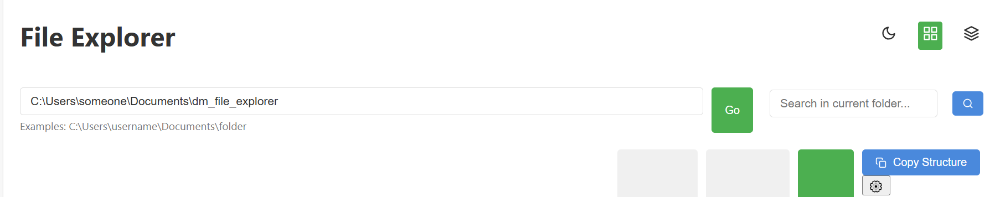
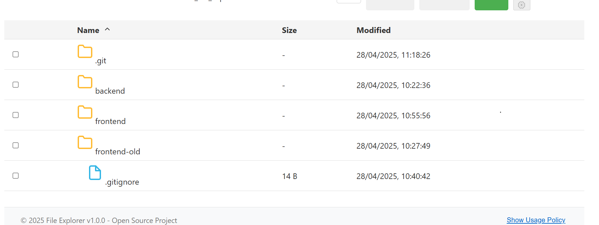
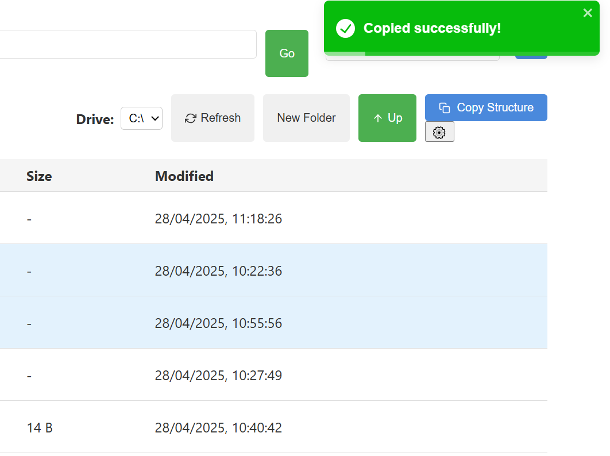
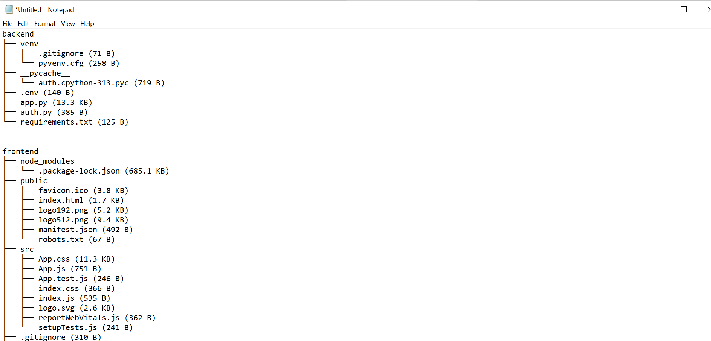

# File Explorer Application

A full-stack file explorer with React frontend and Python backend, featuring:
- Browse local file system with grid/list views
- File/folder operations (create, rename, delete)
- File previews for various formats
- Dark/light mode toggle
- Search functionality
- Path history navigation

 <!-- Add a screenshot if available -->





## Prerequisites

- Python 3.8+
- Node.js 16+
- npm 8+ or yarn 1.22+

## Tech Stack

**Frontend:**
- React 18
- React Router 6
- react-icons
- react-toastify

**Backend:**
- Flask (Python)
- python-magic (for file type detection)

## Installation

### 1. Backend Setup

```bash
# Navigate to backend directory
cd backend

# Create virtual environment (recommended)
python -m venv venv
source venv/bin/activate  # On Windows: venv\Scripts\activate

#if you get this error: 
# ModuleNotFoundError: No module named 'flask_limiter'

#Run
#1
py -m venv venv

#2
.\venv\Scripts\Activate

#3
pip install flask_limiter

#This should solve it.

# Install Python dependencies
pip install -r requirements.txt
